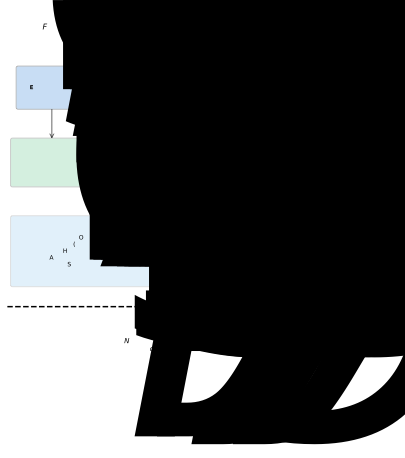
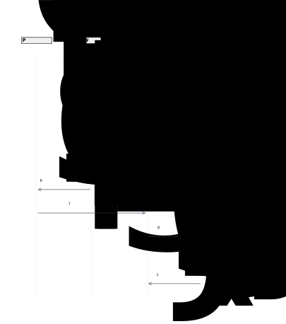
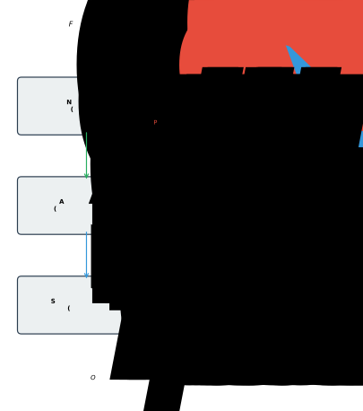

# EIP-191 Consent Architecture for Sovereign Behavioral Health Data Governance: A Hybrid On-Chain/Off-Chain Implementation

**Authors:** Meg Montañez-Davenport, D.N.Psy., BCHN, CBHP

**Affiliation:** Future Systems Lab, NC, USA

**Corresponding author:** future.systems.lab@proton.me

**Intellectual Property:**
- Trademark: USPTO Serial No. 99533250 — "Future Systems Lab," Class 42 (Software/Tech Platform) — Publishing May 19, 2026
- Trademark: USPTO Serial No. 99821948 — "Future Systems Lab," Class 35 (Online Marketplace/Directory) — Filed May 13, 2026
- Patent: U.S. Provisional Application No. 64/063,037 — Filed May 11, 2026 — Assigned to Future Systems Lab LLC (Assignment ID 1803665, recorded May 13, 2026). Patent filed prior to IPFS publication of this manuscript.

**Keywords:** blockchain consent, self-sovereign identity, behavioral health, EIP-191, wallet-based authentication, data sovereignty, decentralized health informatics

---

## Abstract

Centralized behavioral health platforms create a fundamental asymmetry: participants generate intimate wellness data yet have no cryptographic control over access. This paper presents Future Systems Lab™ (FSL), a hybrid decentralized health data infrastructure that replaces click-through consent with EIP-191 cryptographic wallet signatures as the unified mechanism for identity verification, informed consent, and session authorization. The system operates outside HIPAA regulatory scope by architectural design, holding zero protected health information (PHI). We describe the authentication flow from wallet connection through JWT issuance, the hybrid on-chain/off-chain data model anchoring consent events to Ethereum Sepolia, and AlchemistForge — a permissionless smart contract for recording voluntary behavioral health engagement with zero personally identifiable information. Nine smart contracts have been deployed on Sepolia testnet. A comparative evaluation against MedRec, ADvoCATE, Welzel et al. (2025), and US Patent 12,235,984 demonstrates that FSL is, to our knowledge, the first system to unify authentication, informed consent, session authorization, and behavioral health data attribution into a single cryptographic signature event. The system is a testnet proof of concept with a single evaluator; formal user study and mainnet deployment are planned as future work.

---

## 1. Introduction

Behavioral health data occupies a uniquely sensitive position in the health informatics landscape. Unlike laboratory results or imaging data, behavioral health records often contain subjective self-disclosures, therapeutic narratives, and psychological assessments that participants may not want shared even with other healthcare practitioners [1]. Yet the systems that store this data — electronic health records, therapy platforms, and wellness applications — operate on centralized architectures where the platform operator, not the participant, controls access.

The consent mechanisms governing these systems are equally centralized. A typical behavioral health application presents a Terms of Service agreement as a prerequisite to account creation. The participant clicks "I agree" — a legally binding but cryptographically meaningless act. The platform then stores their data in a database it controls, shares it according to policies the participant did not write, and may change those policies unilaterally. The participant's consent is a one-time event with no ongoing enforcement mechanism and no auditable trail [2].

This paper presents an alternative architecture. Future Systems Lab (FSL) is a decentralized health data infrastructure comprising five interconnected platforms that use Ethereum wallet signatures (EIP-191) as the sole mechanism for identity, consent, and access control. In this system:

- **Identity** is a wallet address, not a username and password.
- **Consent** is a cryptographic signature, not a checkbox.
- **Access** is gated by verifiable token claims, not session cookies with opaque identifiers.
- **Revocation** is enforced through JWT expiration, server-side consent grant deletion, and mandatory re-authentication — not buried in account settings.

We use "behavioral health" throughout this paper to denote the FSL domain; however, the system operates strictly in the wellness and educational engagement space, not as a clinical treatment platform. FSL is not a covered entity under HIPAA, holds no protected health information, and maintains no business associate relationships. This regulatory posture is architectural, not administrative — the system is designed to hold no PHI, rather than designed to protect PHI [3].

We describe the complete system architecture (see Figure 1), the cryptographic consent flow (see Figure 2), a zero-PHI data classification model (see Figure 3), and a proof-of-concept deployment demonstrating that behavioral health engagement data can be captured with full participant sovereignty and zero personally identifiable information.

---

## 2. Background and Related Work

### 2.1 Self-Sovereign Identity in Healthcare

Self-sovereign identity (SSI) proposes that individuals should own and control their digital identities without relying on centralized authorities [4]. In healthcare contexts, SSI has been explored through verifiable credentials for vaccination records [5], decentralized identifiers (DIDs) for cross-institutional participant identification [6], and blockchain-based consent management for clinical trial data [7]. Blockchain distributed ledger technologies have been systematically reviewed for biomedical and healthcare applications, with consent management identified as a key use case [8].

However, most SSI implementations in healthcare introduce significant infrastructure complexity — DID registries, verifiable credential issuers, and holder wallets that require specialized software. These systems often replicate the complexity they seek to eliminate, trading one set of intermediaries for another.

### 2.2 Blockchain-Based Consent and Access Control

Several blockchain-based systems have been proposed for healthcare consent and access management. MedRec uses smart contracts to manage access permissions for electronic health records, providing patients with an immutable log of access events [9]. The ADvoCATE platform provides granular consent management through blockchain transactions for IoT personal data processing [10]. Ancile presents a privacy-preserving framework for access control and interoperability of electronic health records using blockchain [11]. Esposito et al. surveyed blockchain approaches to healthcare data security and privacy in cloud environments [12], while Mayer et al. provided a systematic review of electronic health records on blockchain [13].

These systems typically store consent metadata on-chain while keeping health data off-chain — a pattern FSL follows. However, most implementations focus on consent for data sharing between institutions rather than consent as the foundational authentication mechanism. Zyskind et al. proposed using blockchain to decentralize privacy and protect personal data [14], but their approach requires a trusted third-party data store, preserving elements of the centralization problem.

More recently, Welzel et al. (2025) presented a comprehensive analysis of blockchain-based consent management in digital medicine, providing a taxonomy of consent primitives and implementation patterns across jurisdictions [15]. Their work establishes the state of the art against which newer systems — including FSL — must be evaluated (see Section 9).

US Patent 12,235,984 describes a blockchain-based system for healthcare data consent management using smart contracts and cryptographic tokens [16]. While this patent covers consent token issuance and validation, it operates within a traditional identity model (username/password authentication with blockchain-anchored consent tokens) rather than unifying identity and consent into a single cryptographic event.

### 2.3 EIP-191: Signed Data Standard

Ethereum Improvement Proposal 191 defines a standard for signing arbitrary data with an Ethereum private key [17]. The `personal_sign` method, widely implemented across wallet providers, allows a user to sign a human-readable message that can be cryptographically verified by any party holding the user's public address. This creates a minimal SSI primitive: the wallet IS the identity, the signature IS the consent, and verification requires no infrastructure beyond the Ethereum address itself.

### 2.4 EIP-191 vs. EIP-712: Design Rationale

EIP-712 defines a standard for hashing and signing typed structured data [18], offering several advantages over EIP-191: domain separation prevents cross-application signature replay, typed data structures enable on-chain verification via `ecrecover` over structured hashes, and the specification is purpose-built for application-layer signing.

FSL selected EIP-191 `personal_sign` over EIP-712 for three reasons:

**Human readability of consent text.** FSL's consent model requires that the participant read and approve a plain-language informed consent message before signing. The `personal_sign` interface displays the full message text in the wallet approval dialog. EIP-712's structured data presentation varies across wallets and typically renders as a JSON-like field listing rather than a readable narrative — undermining the "informed" requirement of informed consent.

**Broader wallet support.** At the time of development, `personal_sign` (EIP-191) was universally supported across wallet providers including MetaMask, Brave Wallet, Coinbase Wallet, and hardware wallets via browser extensions. EIP-712 `eth_signTypedData_v4` support, while widespread, was not uniform across all target wallets, particularly hardware wallet integrations.

**Server-side verification by design.** FSL's architecture performs signature verification server-side rather than on-chain. The consent signature authorizes JWT issuance; it is not submitted to a smart contract. Because FSL does not require on-chain signature verification, EIP-712's structured hashing advantages (which primarily benefit smart contract verification via `ecrecover`) are not architecturally necessary.

We acknowledge that EIP-712 provides stronger cryptographic guarantees for applications requiring on-chain verification or cross-contract consent delegation. Migration to EIP-712 structured consent messages is identified as future work, particularly as wallet UX for structured data display improves. Smart contract signature verification via EIP-1271 [19] is also under consideration for multi-signature governance scenarios.

### 2.5 Soulbound Tokens and Credential Attestation

The concept of soulbound tokens (SBTs) — non-transferable tokens bound to a specific address — was formalized by Weyl, Ohlhaver, and Buterin as a mechanism for encoding social trust and reputation on-chain [20]. ERC-5192 provides a minimal soulbound interface [21]. FSL uses soulbound ERC-1155 [33] tokens rather than ERC-721 [32] for achievement credentials, as ERC-1155 supports multiple token types within a single contract — enabling both participant and Sovereign Guide credential tiers without separate deployments. This binds verifiable wellness milestones to participant wallet addresses without creating transferable financial instruments.

### 2.6 The Gap

No existing systems, to our knowledge, use EIP-191 wallet signatures as the simultaneous mechanism for:
1. User authentication (replacing username/password)
2. Informed consent (replacing click-through agreements)
3. Session authorization (replacing OAuth tokens)
4. Behavioral health data attribution (replacing PII-based records)

FSL addresses this gap by unifying these four functions into a single cryptographic event. While individual components (wallet authentication, blockchain consent, soulbound credentials) have been explored independently, their integration into a unified consent-as-authentication architecture for behavioral health has not been previously demonstrated.

---

## 3. System Architecture

### 3.1 Platform Overview

FSL comprises five interconnected platforms, each serving a distinct function in the decentralized infrastructure ecosystem (see Figure 1):

1. **EncryptHealth™** — The primary health data platform. Manages participant records, session booking, Sovereign Guide (credentialed wellness facilitator) directories, and consent-gated data access. Deployed as a modern web application with a relational database backend.

2. **HypnoNeuro™** — A suite of browser-based wellness engagement activities with wallet-gated access and token-based engagement incentives.

3. **SovereignLedger™** — On-chain session governance. Records session attestations, superbill generation, and billing events as blockchain transactions.

4. **AlchemistForge™** — A permissionless smart contract and interface for recording voluntary behavioral health engagement (shadow integration) on-chain.

5. **NeuroBalance** — A general wellness dashboard integrating biometric data with on-chain consent management. NeuroBalance is currently scaffolded (the NeuroBalanceConsent smart contract is deployed as infrastructure scaffolding; full platform development is planned) and is positioned as a general wellness product under FDA guidance [22]; it does not perform clinical diagnosis or treatment.

All five platforms share a single authentication architecture: EIP-191 wallet signature, JWT cookie issuance, and middleware-verified access.



### 3.2 Authentication Flow

The authentication flow proceeds in six steps (see Figure 2):

**Step 1 — Wallet Detection.** The client application detects available wallet providers using the `window.ethereum` interface. FSL implements EIP-6963 multi-provider discovery [23], preferring Brave Wallet when available but supporting any injected Ethereum provider.

**Step 2 — Account Request.** The application calls `eth_requestAccounts` on the selected provider, prompting the user to authorize the connection. This returns the user's Ethereum address but does not yet constitute consent.

**Step 3 — Nonce Generation.** The client requests a cryptographic nonce from the server. The server generates a 128-bit random nonce using a cryptographically secure random number generator (conforming to NIST SP 800-63B [24]) and returns it to the client. The nonce is bound to the requesting wallet address, stored server-side with a time-to-live (TTL), and is single-use — consumed upon successful verification or expiration.

**Step 4 — Consent Message Construction.** The client constructs a human-readable consent message containing:
- A plain-language description of what the user is consenting to
- Educational disclaimers (FSL is not a medical facility; data is educational, not clinical)
- The user's wallet address
- The server-generated nonce
- An ISO 8601 timestamp

This message serves simultaneously as informed consent and authentication challenge.

**Step 5 — Cryptographic Signature.** The client calls `personal_sign` with the consent message and the user's address. The wallet provider displays the full message text and requires explicit user approval before signing. The resulting signature is a 65-byte ECDSA signature (r: 32 bytes, s: 32 bytes, v: 1 byte recovery parameter) over the EIP-191 prefixed message hash [25].

**Step 6 — Server Verification and JWT Issuance.** The client sends `{address, signature, message}` to the server verification endpoint. The server:
- Recovers the signer address from the signature using ECDSA public key recovery [25]
- Verifies the recovered address matches the claimed address
- Validates the nonce and marks it as consumed
- Validates the consent message contains required phrases (educational disclaimer, sovereignty acknowledgment)
- Issues a JSON Web Token (JWT) [26] signed with HMAC-SHA256 (HS256) using a server-held symmetric secret, containing the verified address, role (participant or guide), and a configurable expiration (maximum 24 hours). HS256 was selected for implementation simplicity; migration to ES256 (ECDSA-P256) for asymmetric non-repudiation is identified as future work
- The JWT is delivered as an HttpOnly, Secure, SameSite=Strict browser cookie



### 3.3 Middleware Verification Layer

Every protected route passes through a server-side middleware layer that:
1. Extracts the session cookie from the request
2. Verifies the JWT signature using the server's signing key
3. Checks token expiration
4. Extracts the verified wallet address and role from the payload
5. Injects the verified address into request headers
6. Enforces role-based access (guide role required for Sovereign Guide routes)

If verification fails, page routes redirect to the landing page; API routes return 401. The middleware runs on every request to protected routes, ensuring that every page load and API call is authorized by a valid, unexpired token derived from a cryptographic consent signature.

### 3.4 Consent-Gated Access Patterns

The architecture implements three levels of consent gating:

**Level 1 — Platform Access.** The initial `personal_sign` consent grants access to the platform. Without this signature, the middleware blocks all protected routes.

**Level 2 — Sovereign Guide Access.** Participants can grant specific Sovereign Guides access to their wellness records through a separate consent transaction. This grant is stored in the database and can be revoked by the participant, which deletes the consent grant server-side and blocks future access.

**Level 3 — On-Chain Attestation.** Session records, superbills, and achievement milestones are anchored to the blockchain through smart contract calls, creating an immutable audit trail of consent-authorized interactions.

### 3.5 Session Refresh and Revocation Semantics

To prevent session interruption during active use, the system implements a JWT refresh mechanism. A client-side timer fires before JWT expiry. The refresh endpoint verifies the existing JWT is still valid and issues a fresh token with the same claims.

Revocation in the FSL architecture operates through three complementary mechanisms: (1) JWT expiration — tokens have a maximum lifetime of 24 hours and cannot be renewed after expiry without a fresh wallet signature; (2) server-side consent grant deletion — when a participant revokes a Sovereign Guide's access, the database grant is deleted immediately, blocking future queries regardless of JWT validity; and (3) re-authentication enforcement — session-critical actions (e.g., initiating a new session, modifying consent grants) require a fresh wallet signature regardless of existing JWT validity. Wallet disconnection at the client level is a user-experience convenience that clears the local session state but does not, by itself, invalidate an issued JWT. The JWT remains technically valid until its expiration timestamp, which is why the maximum expiration is bounded.

---

## 4. EIP-191 Consent Attestation Method

### 4.1 Cryptographic Consent vs. Click-Through Consent

Traditional click-through consent suffers from four fundamental weaknesses:

1. **Non-verifiability.** There is no cryptographic proof that the user read or understood the terms. A checkbox state is trivially forgeable.
2. **Non-attributability.** The consent event is tied to a session cookie or account ID, not to a cryptographic identity. Anyone with the credentials can "consent."
3. **Weak revocability.** Revoking consent requires navigating account settings and trusting the platform to honor the revocation. There is no independent verification mechanism.
4. **Non-portability.** The consent exists only in the platform's database. The user has no independent record of what they consented to.

EIP-191 wallet signatures address these weaknesses:

1. **Verifiable.** The signature is a cryptographic proof that the holder of the private key approved the exact message text. Any third party can verify this independently.
2. **Attributable.** The signature is bound to a specific Ethereum address. Only the holder of the corresponding private key could have produced it.
3. **Revocable within defined bounds.** The participant can revoke future access authorization through consent grant deletion and JWT expiration. Past data stored in the database is not deleted by session termination; data deletion is handled through a separate data lifecycle process (see Section 10.2).
4. **Portable.** The signed message and signature constitute a self-contained proof of consent that the participant can retain and present to any verifier.

### 4.2 EIP-191 Signature Verification Pattern

The following listing illustrates the server-side EIP-191 signature verification pattern used to recover the signer's Ethereum address from a signed consent message. This is a generalized pattern; implementation-specific details are omitted.

```javascript
// Listing 1: EIP-191 Signature Verification Pattern (JavaScript/ethers.js)
const { ethers } = require('ethers');

function verifyConsentSignature(message, signature, claimedAddress) {
  // EIP-191 prefixed message hash:
  // "\x19Ethereum Signed Message:\n" + len(message) + message
  const recoveredAddress = ethers.verifyMessage(message, signature);

  // Verify recovered address matches claimed address
  if (recoveredAddress.toLowerCase() !== claimedAddress.toLowerCase()) {
    throw new Error('Signature verification failed: address mismatch');
  }

  // Validate consent message contains required phrases
  const requiredPhrases = [
    'educational purposes',
    'not a medical facility',
    'sovereign data governance'
  ];
  for (const phrase of requiredPhrases) {
    if (!message.toLowerCase().includes(phrase)) {
      throw new Error(`Missing required consent phrase: ${phrase}`);
    }
  }

  return { verified: true, address: recoveredAddress };
}
```

The `ethers.verifyMessage` function internally prepends the EIP-191 prefix (`\x19Ethereum Signed Message:\n` followed by the message length), computes the Keccak-256 hash, and performs ECDSA public key recovery to derive the signer address [17]. This server-side verification is the architectural basis for the claim that consent and authentication are unified: the same cryptographic operation that proves identity also proves consent to the message content.

### 4.3 The FSL Consent Message

The FSL consent message is designed to function simultaneously as a legal informed consent document and a cryptographic authentication challenge (see Figure 2). The consent message contains four categories of information:

- **Consent scope:** What the user is agreeing to (educational decentralized infrastructure for sovereign data governance access)
- **Disclaimers:** What FSL is not (not a medical facility, not clinical, not a covered entity under HIPAA)
- **Rights declaration:** The user's sovereignty over their own data
- **Cryptographic binding:** The wallet address, nonce, and timestamp that prevent replay and ensure attribution

The server validates that the signed message contains the required consent phrases before issuing a JWT. A message that omits the disclaimers or modifies the consent scope will be rejected.

---

## 5. Zero-PHI Data Model

### 5.1 Data Classification Architecture

FSL employs a hybrid on-chain/off-chain data architecture designed to ensure that no protected health information (PHI) as defined by 45 CFR Section 160.103 [3] exists anywhere in the system (see Figure 3).

**On-chain (Ethereum Sepolia):**
- Consent events (wallet signatures verified server-side; attestation hashes anchored on-chain)
- Session attestations (content hashes anchored to SovereignLedger)
- Achievement credentials (soulbound ERC-1155 tokens)
- Engagement records (AlchemistForge voluntary disclosures)

**Off-chain (PostgreSQL + IPFS):**
- Session metadata (aggregate engagement data, no clinical notes)
- Wellness engagement metrics (aggregate, non-clinical)
- Encrypted documents (IPFS-pinned, wallet-gated decryption)

This hybrid approach addresses the fundamental tension between blockchain immutability and healthcare data requirements: data that could become sensitive is encrypted and stored off-chain where it can be managed (and deleted if necessary), while consent events and attestations are anchored on-chain where they provide an immutable audit trail.


### 5.2 Regulatory Scope: Outside HIPAA by Architectural Design

FSL operates outside HIPAA regulatory scope by architectural design — the system holds zero PHI, is not a covered entity, and maintains no business associate relationships. This determination rests on three architectural properties as defined by 45 CFR Section 160.103 [3]:

1. **No PHI storage.** The system stores no individually identifiable health information. Participants are identified solely by pseudonymous Ethereum wallet addresses. No names, dates of birth, Social Security numbers, medical record numbers, or any of the 18 HIPAA identifiers are collected or stored. Wellness engagement metrics are aggregate and non-clinical.

2. **Not a covered entity.** FSL does not furnish, bill, or receive payment for healthcare services as defined under HIPAA. Sovereign Guides operating through the platform are credentialed wellness facilitators offering educational engagement, not clinical treatment. The platform does not submit claims to health plans or clearinghouses.

3. **No business associate relationships.** FSL does not create, receive, maintain, or transmit PHI on behalf of a covered entity. No business associate agreements (BAAs) exist because no PHI flows through the system.

The de-identification standard under 45 CFR Section 164.514 [27] provides additional support: even if any data element were arguably health-related, the absence of all 18 Safe Harbor identifiers and the use of pseudonymous wallet addresses satisfy the de-identification threshold.

This paper explicitly does not claim HIPAA compliance, as such a claim would imply covered-entity status. The correct characterization is that the system is architecturally positioned outside the scope of HIPAA regulation.

Additionally, 42 CFR Part 2 [28], which governs confidentiality of substance use disorder records, does not currently apply because FSL does not operate as a federally assisted program and does not maintain substance use disorder patient records. This exclusion is a current-state determination; acceptance of federal funding or Medicaid participants would require reassessment. The FTC Health Breach Notification Rule [29] is acknowledged as potentially applicable to non-HIPAA health data platforms and is monitored as a compliance consideration.

### 5.3 Practitioner Independence and Tax Responsibility

Sovereign Guides operating through the FSL ecosystem are independent practitioners, not employees, contractors, or agents of FSL. FSL provides decentralized infrastructure — payment rails, attestation contracts, credential verification — but does not direct, supervise, or oversee the practice of any Guide.

FSL's architectural design facilitates practitioner independence; applicable tax reporting obligations are the responsibility of each practitioner. FSL does not withhold or remit taxes, does not maintain employer-of-record status, and does not provide professional liability coverage. Independent contractor status is a legal determination that varies by jurisdiction and is not an architectural certainty. All session revenue, HNT rewards, BenevolenceFund distributions, and SovereignAchievement credentials with monetary value are reportable income to the receiving practitioner. Crypto-denominated compensation is treated as ordinary income at fair market value on the date received per IRS Notice 2014-21 [36] and subsequent guidance.

This positioning is architectural rather than contractual: each session payment flows between participant wallet and practitioner wallet via the SovereignLedger contract, with the 3% BenevolenceFund and 27% FSL operations splits handled by the contract at transaction time. There is no FSL-controlled escrow account holding practitioner funds. The 70/27/3 revenue split is designed to be enforced by smart contract logic at transaction time, not by FSL discretion.

---

## 6. Sovereign Guide Attestation Lifecycle

### 6.1 Session Initiation and Attestation

SovereignSession extends the consent architecture from platform access to individual session governance (see Figure 4). The attestation lifecycle proceeds as follows:

1. **Session Initiation.** The Sovereign Guide initiates a session by calling the contract's session start function, passing the participant's wallet address and a content hash as parameters. The guide's wallet signature authorizes the transaction. The participant does not co-sign on-chain; their consent is established through the platform-level EIP-191 authentication and the explicit session booking consent recorded in the off-chain database.

2. **Session Recording.** During the session, engagement data is recorded off-chain. No clinical notes, diagnostic codes, or treatment plans are stored. The on-chain record contains only the guide address, participant address, content hash, and timestamp.

3. **Session Completion.** Either the guide or participant can mark the session as complete through the contract interface.

4. **Attestation Finalization.** Upon completion, the contract emits an event recording the final session state. This event serves as an immutable attestation that the session occurred, was authorized by a credentialed guide, and involved a consenting participant.



```solidity
// Listing 2: Session Attestation Event Pattern (Solidity)
event SessionStarted(
    address indexed guide,
    address indexed participant,
    bytes32 contentHash,
    uint256 timestamp
);

event SessionEnded(
    address indexed guide,
    address indexed participant,
    uint256 duration,
    uint256 timestamp
);
```

This event-driven pattern ensures that session attestations are publicly queryable and independently verifiable without exposing session content. The `contentHash` parameter allows off-chain session data integrity to be verified against the on-chain anchor without revealing the data itself.

### 6.2 AlchemistForge: Permissionless Engagement Recording

AlchemistForge is a minimal smart contract designed to record voluntary behavioral health engagement — specifically, Jungian shadow integration [30] — on the Ethereum blockchain. The contract exposes two public functions: one for recording a shadow aspect (keyed to the caller's address) and one for marking the integration as complete. Both emit events that are publicly queryable.

The design is deliberately minimal: no owner, no admin functions, no pause mechanism, no token economics. The contract exists solely to record a participant's voluntary disclosure (a shadow aspect they are integrating) and their subsequent celebration of that integration.

### 6.3 Privacy Properties of On-Chain Engagement Data

AlchemistForge demonstrates that meaningful behavioral health engagement data can be captured on a public blockchain with zero personally identifiable information:

- The participant is identified only by their Ethereum wallet address (pseudonymous)
- The shadow aspect text is voluntary and self-authored by the participant
- No diagnosis, session plan, or clinical assessment is recorded
- The data is publicly verifiable but not attributable to a real-world identity without external information
- The participant chooses when, whether, and what to disclose

We acknowledge that Ethereum addresses are pseudonymous, not anonymous. Address clustering, exchange KYC records, and on-chain behavioral analysis can potentially de-anonymize wallet addresses [14]. The zero-PHI architecture mitigates this risk by ensuring that even if an address is linked to a real-world identity, the on-chain data contains no health information — only engagement attestations.

---

## 7. Implementation

### 7.1 Smart Contracts

FSL has deployed nine smart contracts on the Ethereum Sepolia testnet:

| Contract | Address | Purpose | Access Control |
|----------|---------|---------|---------------|
| HypnoNeuroToken (HNT) | 0x1ae1e10929f008d1f9883ce574a318abd86084e2 | ERC-20 [31] wellness engagement token | Owner-minted |
| EncryptHealthToken (EHT) | 0x93583a7A24e50075c79b06db0be8Cf4D45B0bd88 | Platform-specific ERC-20 | Owner-minted |
| MindMasteryNFT | 0xCb9EcB00574DB29976c7C54045d443666D5C7771 | ERC-1155 [33] achievement credentials | Owner-minted |
| SovereignLedger v2 | 0x4afA577fA914068451e0Aa97b61F23960f02aCc4 | Session governance and attestation | Open registration |
| AlchemistForge | 0xE092336F8f5082e57CcBb341A110C20ad186A324 | Voluntary engagement recording | Fully permissionless |
| BenevolenceFund v2 | 0x96E8006a1fBB693B55fFf6254B8BF19EC605251B | Community wellness treasury | Owner-distributed |
| SovereignAchievement | 0xC3F11d2F1F12bB96b9DCF7e8f85e9704D2869B8D | ERC-1155 [33] soulbound credentials | Owner-minted |
| NeuroBalanceConsent | 0x21571805e57f792b66604b140a45D8C1b2E196b8 | Biosensor consent scaffold | Owner-controlled |
| SovereignSession | 0xbeb13A360C6F0C77Ea3af3650Ab9762a1B9965A1 | Guide-initiated session attestation | Guide-initiated |

The contracts range from fully permissionless (AlchemistForge — anyone can call the engagement function) to owner-controlled (token minting, achievement awards). SovereignAchievement is a single ERC-1155 contract that issues soulbound (non-transferable) credentials to both Sovereign Guides and participants, using token ID ranges to differentiate credential types. This spectrum reflects a deliberate architectural choice: participation data is sovereign (the participant controls when and what they record), while credential issuance is governed (the platform verifies achievements before minting).

All owner-controlled contracts are currently deployed from a single deployer wallet. This centralization is acknowledged as a limitation; migration to multisig governance is planned for mainnet deployment (see Section 10.3).

### 7.2 Wallet Integration

FSL uses a minimal wallet integration layer that communicates directly with `window.ethereum`, avoiding the dependency chain of wallet abstraction libraries. The client-side wallet context:

1. Reads the JWT cookie synchronously on mount to determine authentication state
2. Exposes a connection method for initiating wallet connections
3. Implements a refresh method for re-reading authentication state after token refresh
4. Implements provider preference logic when multiple wallets are injected (EIP-6963)

This approach eliminates external wallet SDK dependencies that introduce relay servers, WebSocket connections, and cloud-hosted session state — all of which contradict the sovereignty model.

### 7.3 Content Security and API Protection

The backend API implements origin-based CORS whitelisting restricted to FSL platform domains. All sensitive endpoints require wallet signature authentication via middleware that verifies authenticated session headers. Rate limiting is applied per IP to prevent abuse, with stricter limits on the nonce generation endpoint. The API is accessible only through a TLS-terminating reverse proxy providing DDoS protection and IP obfuscation of the origin server.

---

## 8. Deployment Status

As of the writing of this paper, the FSL ecosystem has been deployed on Ethereum Sepolia testnet with the following deployment characteristics:

Table 3. Deployment Metrics (Ethereum Sepolia Testnet)

| Metric | Value |
|--------|-------|
| Smart contracts deployed | 9 (verified on Blockscout) |
| Testnet | Ethereum Sepolia (PoS, free gas) |
| Deployment block range | ~10,610,642 – 10,848,153 |
| Operational platforms | 4 deployed + 1 scaffolded (NeuroBalance) |
| Wallet authentication latency | ~4–6 seconds (measured in testing) |
| Token mint gas (observed) | ~37,000–54,000 gas per `mint()` call |
| Session registration gas (observed) | ~69,000 gas per `registerClaim()` call |
| Contract deployment gas (observed) | 575,000–1,769,000 gas per contract |
| Post-deployment interactions | Architect-initiated only; no external organic adoption measured |
| Unique external wallet interactions | 0 (all activity from deployer + campaign wallets) |

All metrics were queried from the Ethereum Sepolia block explorer (Blockscout) at time of paper preparation. Gas values represent observed testnet costs; mainnet costs will differ based on network conditions and L1/L2 deployment choice.

AlchemistForge has been deployed at address `0xE092336F8f5082e57CcBb341A110C20ad186A324`. As of paper preparation, all participation activity is architect-initiated or campaign-generated (the principal investigator's Case Study #1 plus content-engine-driven awareness campaign wallets); no external organic adoption has been measured. Formal user study with external participants is planned (see Section 10.3). The system has been tested with a single Sovereign Guide (the principal investigator). Multi-guide consent dynamics remain untested.

---

## 9. Comparative Analysis

### 9.1 Comparative Properties Table

Table 2 presents a comparative analysis of FSL against four blockchain-based consent and health data systems: Welzel et al. (2025) [15], US Patent 12,235,984 [16], MedRec [9], and ADvoCATE [10].

| Property | FSL (This Paper) | Welzel et al. 2025 [15] | US 12,235,984 [16] | MedRec [9] | ADvoCATE [10] |
|----------|------------------|------------------------|---------------------|------------|---------------|
| **Jurisdiction** | US (non-HIPAA) | EU (GDPR) | US (HIPAA-adjacent) | US (HIPAA-adjacent) | EU (GDPR) |
| **Blockchain Type** | Ethereum (Sepolia testnet; public) | Consortium (Hyperledger) | Permissioned | Ethereum (private fork) | Ethereum (private) |
| **Consent Primitive** | EIP-191 wallet signature (unified auth + consent) | Smart contract permission grant | Cryptographic consent token | Smart contract ACL | Blockchain transaction |
| **Data Model** | Zero-PHI; pseudonymous wallet addresses only | Encrypted PHI with consent-gated access | Tokenized consent references | Pointer-based (off-chain EHR) | On-chain consent, off-chain data |
| **Actor Model** | Participant (wallet) + Sovereign Guide (wallet) | Patient + Provider + Institution | Patient + Provider + System | Patient + Provider + Institution | Data subject + Controller + Processor |
| **Auth-Consent Unification** | Yes — single signature event | No — separate authentication | No — separate authentication | No — separate authentication | No — separate authentication |
| **Implementation Status** | Testnet deployment, 9 contracts, single-guide | Described architecture, no deployment reported | Patent granted, implementation not public | Prototype on private Ethereum fork | Proof-of-concept |

### 9.2 Key Differentiators

**Consent-as-authentication.** FSL is unique among the compared systems in unifying authentication and informed consent into a single cryptographic event. MedRec, ADvoCATE, Welzel et al., and US 12,235,984 all treat authentication and consent as separate operations, typically authenticating via traditional credentials and then recording consent as a subsequent blockchain transaction. FSL's architecture eliminates this separation: the wallet signature that proves identity simultaneously constitutes informed consent, and the server rejects signatures over messages that lack required consent phrases.

**Zero-PHI by design.** While MedRec and Welzel et al. store encrypted PHI with consent-gated access (a "protect PHI" model), FSL stores no PHI at all (a "hold no PHI" model). This architectural distinction has regulatory implications: systems that store encrypted PHI must still comply with HIPAA (or GDPR) data protection requirements, including breach notification, access controls, and audit trails for the encrypted data. FSL's zero-PHI model places the system outside these regulatory frameworks entirely.

**Behavioral health focus.** FSL is the only system among those compared that specifically targets behavioral health engagement data. MedRec focuses on general EHR access management, ADvoCATE on IoT personal data, and Welzel et al. on general digital medicine consent. The behavioral health domain introduces unique sensitivity requirements that FSL addresses through its voluntary disclosure model (AlchemistForge) and pseudonymous participation.

### 9.3 Limitations of the Comparison

This comparative analysis is limited by several factors. First, the compared systems operate at different maturity levels — MedRec and ADvoCATE are published prototypes, US 12,235,984 is a granted patent with no publicly available implementation, and Welzel et al. present an architectural framework. Direct performance comparison is therefore not possible. Second, the systems target different regulatory jurisdictions (US vs. EU), making consent primitive comparison context-dependent. Third, FSL's testnet deployment lacks the economic security guarantees that would apply to a mainnet deployment. A formal user study comparing participant-perceived sovereignty across consent models is planned as future work (see Section 10.3).

---

## 10. Discussion

### 10.1 Architectural Tradeoffs

The FSL architecture makes explicit tradeoffs between decentralization and usability:

**Authentication latency.** The `personal_sign` flow requires several seconds (nonce request, user approval, signature verification) compared to sub-second username/password authentication. We mitigate this with JWT tokens that avoid re-signing on every page load, combined with a refresh mechanism for session continuity.

**Wallet dependency.** Participants must have a Web3 wallet (Brave Browser with Brave Wallet, or a compatible alternative). This introduces a significant adoption barrier for non-technical users. Account abstraction via ERC-4337 [34] is under evaluation as a path to reduce this barrier while preserving the sovereignty model.

**Testnet limitations.** All contracts are deployed on Sepolia testnet, which operates under proof-of-stake consensus without the economic security guarantees of Ethereum mainnet. Transactions are free, and the network could theoretically be reset. Production deployment requires migration to a mainnet with associated gas costs and formal security audit.

**Centralized components.** Despite the decentralized authentication layer, FSL retains centralized components: the PostgreSQL database, the frontend hosting, and the API server. These components are necessary for operational performance but represent single points of failure. The hybrid data model ensures that consent events and critical attestations are anchored on-chain even if centralized components become unavailable. The blockchain provides auditability and tamper-evidence for consent events, not full decentralization of the system.

### 10.2 Revocability and Data Lifecycle

The revocability properties of EIP-191 consent signatures must be precisely characterized. JWT is a stateless token format [26]; once issued, a JWT cannot be invalidated by the server before its expiration timestamp. Wallet disconnection is a client-side operation that clears local session state but does not invalidate an outstanding JWT.

Effective revocation in the FSL architecture therefore operates through three mechanisms:

1. **JWT expiration.** All tokens carry a maximum lifetime of 24 hours. After expiration, the participant must produce a fresh EIP-191 consent signature to obtain a new token. This bounds the maximum window during which a revoked session could theoretically remain active.

2. **Server-side consent grant deletion.** When a participant revokes a Sovereign Guide's access, the corresponding database record is deleted immediately. Subsequent API requests from the guide — even with a valid JWT — will fail authorization checks against the consent grant table.

3. **Re-authentication for session-critical actions.** Operations that modify consent state (granting or revoking guide access, initiating sessions) require a fresh wallet signature regardless of existing JWT validity, ensuring that stale sessions cannot perform sensitive operations.

This three-layer revocation model provides practical access termination while honestly acknowledging the limitations of stateless token architectures. We note that JWT best current practices [35] recommend short-lived tokens and server-side revocation lists for high-security applications; FSL's approach is consistent with these recommendations.

### 10.3 Limitations and Future Work

1. **Single-evaluator deployment.** The current system has been tested with a single Sovereign Guide (the principal investigator). Multi-guide consent dynamics, including cross-guide data sharing and consent conflict resolution, remain untested. No formal user study has been conducted; a mixed-methods evaluation comparing participant-perceived sovereignty under wallet-based vs. click-through consent requires IRB approval and is planned.

2. **Testnet only with centralized governance.** All contracts are deployed on Sepolia testnet with no real economic value at stake. Seven of nine contracts are controlled by a single deployer wallet, creating centralization risk. Migration to mainnet with multisig governance and formal security audit is planned.

3. **Browser wallet dependency and key management.** The system requires a browser with an injected Ethereum provider (e.g., Brave Wallet). Wallet private key loss results in permanent loss of identity and on-chain credentials. Account abstraction via ERC-4337 [34] and social recovery mechanisms are identified as future work.

4. **Formal verification and cross-chain federation.** Mathematical proof that the consent architecture satisfies the properties of verifiability, attributability, revocability, and portability claimed in Section 4 is planned. Cross-chain consent federation enabling a single wallet signature to authorize data sharing across independent platforms is identified as future work.

5. **Two-Party Wallet-Signed Mutual Authentication with Client-Side Encrypted Session Recording (Phase 5 doctoral research).** The capstone research advances SovereignSession from single-party attestation to bilateral cryptographic consent: both Guide and Participant submit EIP-191 signatures before session start, verified on-chain. Client-side AES-256-GCM encrypted video, IPFS-pinned, participant-held decryption key. To our knowledge, no existing telehealth platform implements this combination. This is not claimed as implemented.

---

## 11. Conclusion

This paper presented the architecture and implementation of a wallet-based consent system for behavioral health data governance. By using EIP-191 cryptographic signatures as the unified mechanism for authentication, consent, and access control, the system eliminates the architectural separation between identity and authorization that characterizes centralized health platforms. The consent event becomes the authentication event — a single cryptographic act that is verifiable, attributable, revocable within defined bounds, and portable.

The system operates outside HIPAA regulatory scope by architectural design, storing zero protected health information and functioning as neither a covered entity nor a business associate. This zero-PHI model represents an alternative to the prevailing "encrypt and protect PHI" approach: rather than building compliance infrastructure around sensitive data, FSL is designed so that no sensitive data enters the system in the first place.

The comparative evaluation against MedRec, ADvoCATE, Welzel et al. (2025), and US Patent 12,235,984 demonstrates that FSL is, to our knowledge, the first system to unify authentication and informed consent into a single EIP-191 signature event for behavioral health data governance. The AlchemistForge case study demonstrates that meaningful behavioral health engagement data can be captured on a public blockchain with full participant sovereignty and zero personally identifiable information.

The system is not without limitations — testnet deployment, single-guide scope, browser wallet dependency, and the inherent constraints of stateless JWT revocation limit its current applicability. However, the architectural pattern of unifying consent and authentication through cryptographic signatures is generalizable beyond the FSL context and may inform the design of future health informatics systems where participant data sovereignty is a first-class requirement.

---

## Figure Captions

**Figure 1.** System architecture of the FSL decentralized health data infrastructure. Four deployed platforms (EncryptHealth, HypnoNeuro, SovereignLedger, AlchemistForge) and one scaffolded platform (NeuroBalance) share a unified EIP-191 authentication layer. On-chain components (Ethereum Sepolia) store consent attestations and achievement credentials; off-chain components (PostgreSQL, IPFS) store encrypted session data and engagement metrics. Arrows indicate data flow direction; dashed borders indicate scaffolded or planned components.

**Figure 2.** EIP-191 consent attestation flow. The six-step authentication sequence: (1) wallet detection via EIP-6963, (2) account request, (3) server-side nonce generation with TTL and address binding, (4) consent message construction with educational disclaimers, (5) cryptographic signature via `personal_sign`, (6) server-side ECDSA recovery, consent validation, and JWT issuance. The consent message serves simultaneously as informed consent document and authentication challenge.

**Figure 3.** Zero-PHI data classification model. Data elements are classified into three tiers: Tier 1 (on-chain, public) includes consent attestation hashes, session event emissions, and soulbound achievement tokens — all containing zero PHI and zero PII. Tier 2 (off-chain, encrypted) includes session metadata and aggregate wellness metrics — containing no PHI but stored in encrypted form for defense in depth. Tier 3 (off-chain, wallet-gated) includes IPFS-pinned documents accessible only via wallet-authenticated decryption. No tier contains any of the 18 HIPAA Safe Harbor identifiers.

**Figure 4.** Sovereign Guide attestation lifecycle. The guide initiates a session on-chain by submitting the participant's wallet address and a content hash. The contract emits a `SessionStarted` event. During the session, engagement data is recorded off-chain. Upon completion, either party can finalize the session, triggering a `SessionEnded` event. The on-chain record contains only wallet addresses, content hash, and timestamps — no session content.

---

## AI Use Disclosure

AI tools (Anthropic Claude, Claude Code) were used for drafting assistance, technical review, and copy editing. All architectural decisions, factual claims, and final manuscript content are the responsibility of the author.

---

## References

[1] Rothstein, M.A. (2010). The Hippocratic bargain and health information technology. *Journal of Law and the Biosciences*, 1(1), 7-12.

[2] Cate, F.H., & Mayer-Schonberger, V. (2013). Notice and consent in a world of Big Data. *International Data Privacy Law*, 3(2), 67-73.

[3] 45 CFR §160.103: Definitions — Protected Health Information, Covered Entity, Business Associate. U.S. Department of Health and Human Services.

[4] Allen, C. (2016). The path to self-sovereign identity. *Life with Alacrity*. Retrieved from http://www.lifewithalacrity.com/2016/04/the-path-to-self-soverereign-identity.html

[5] Eisenstadt, M., Ramachandran, M., Chowdhury, N., et al. (2020). COVID-19 antibody test/vaccination certification: There's an app for that. *IEEE Open Journal of Engineering in Medicine and Biology*, 1, 148-155.

[6] Houtan, B., Hafid, A.S., & Makrakis, D. (2020). A survey on blockchain-based self-sovereign patient identity in healthcare. *IEEE Access*, 8, 90478-90494.

[7] Maslove, D.M., Klein, J., Barber, K., & Allan, A. (2018). Using blockchain technology to manage clinical trials data: A proof-of-concept study. *JMIR Medical Informatics*, 6(4), e11949.

[8] Kuo, T.-T., Kim, H.-E., & Ohno-Machado, L. (2017). Blockchain distributed ledger technologies for biomedical and health care applications. *Journal of the American Medical Informatics Association*, 24(6), 1211-1220. doi:10.1093/jamia/ocx068

[9] Azaria, A., Ekblaw, A., Vieira, T., & Lippman, A. (2016). MedRec: Using blockchain for medical data access and permission management. *International Conference on Open and Big Data (OBD)*, 25-30.

[10] Rantos, K., Drosatos, G., Demertzis, K., et al. (2019). ADvoCATE: A consent management platform for personal data processing in the IoT using blockchain technology. *International Conference on Security for Information Technology and Communications*, 300-313.

[11] Dagher, G.G., Mohler, J., Milner, M., Marella, A., & Muraleedharan, N. (2018). Ancile: Privacy-preserving framework for access control and interoperability of electronic health records using blockchain technology. *Sustainable Cities and Society*, 39, 283-297. doi:10.1016/j.scs.2018.02.014

[12] Esposito, C., De Santis, A., Tortora, G., Chang, H., & Choo, K.-K.R. (2018). Blockchain: A panacea for healthcare cloud-based data security and privacy? *IEEE Cloud Computing*, 5(1), 31-37. doi:10.1109/MCC.2018.011791712

[13] Mayer, A.H., da Costa, C.A., & Righi, R.R. (2020). Electronic health records in a blockchain: A systematic review. *Health Informatics Journal*, 26(2), 1273-1288. doi:10.1177/1460458219866350

[14] Zyskind, G., Nathan, O., & Pentland, A. (2015). Decentralizing privacy: Using blockchain to protect personal data. *IEEE Security and Privacy Workshops*, 180-184. doi:10.1109/SPW.2015.27

[15] Welzel, C., Ostermann, M., Smith, H.L., Minssen, T., Kirsten, T., Gilbert, S. (2025). Enabling secure and self determined health data sharing and consent management. *npj Digital Medicine*, 8:560. DOI: 10.1038/s41746-025-01945-z.

[16] US Patent No. 12,235,984. Blockchain-based healthcare data consent management system. United States Patent and Trademark Office.

[17] Ethereum Foundation. (2018). EIP-191: Signed data standard. *Ethereum Improvement Proposals*. Retrieved from https://eips.ethereum.org/EIPS/eip-191

[18] Ethereum Foundation. (2017). EIP-712: Typed structured data hashing and signing. *Ethereum Improvement Proposals*. Retrieved from https://eips.ethereum.org/EIPS/eip-712

[19] Ethereum Foundation. (2018). EIP-1271: Standard signature validation method for contracts. *Ethereum Improvement Proposals*. Retrieved from https://eips.ethereum.org/EIPS/eip-1271

[20] Weyl, E.G., Ohlhaver, P., & Buterin, V. (2022). Decentralized Society: Finding Web3's Soul. *SSRN Electronic Journal*.

[21] Ethereum Foundation. (2022). ERC-5192: Minimal soulbound NFTs. *Ethereum Improvement Proposals*. Retrieved from https://eips.ethereum.org/EIPS/eip-5192

[22] U.S. Food and Drug Administration. (2019). General wellness: Policy for low risk devices (FDA-2014-N-1039). Guidance for Industry and Food and Drug Administration Staff.

[23] Ethereum Foundation. (2023). EIP-6963: Multi injected provider discovery. *Ethereum Improvement Proposals*. Retrieved from https://eips.ethereum.org/EIPS/eip-6963

[24] National Institute of Standards and Technology. (2017). NIST Special Publication 800-63B: Digital identity guidelines — Authentication and lifecycle management. U.S. Department of Commerce.

[25] Certicom Research. (2009). SEC 1: Elliptic curve cryptography, Version 2.0. Standards for Efficient Cryptography Group. Section 4.1.6: Public key recovery operation.

[26] Jones, M., Bradley, J., & Sakimura, N. (2015). JSON Web Token (JWT). IETF RFC 7519.

[27] 45 CFR §164.514: Other requirements relating to uses and disclosures of protected health information — De-identification standard. U.S. Department of Health and Human Services.

[28] 42 CFR Part 2: Confidentiality of substance use disorder patient records. Substance Abuse and Mental Health Services Administration.

[29] Federal Trade Commission. (2009). Health Breach Notification Rule, 16 CFR Part 318.

[30] Jung, C.G. (1959). The archetypes and the collective unconscious. In *Collected Works of C.G. Jung*, Vol. 9, Part 1. Princeton University Press.

[31] Vogelsteller, F., & Buterin, V. (2015). ERC-20: Token standard. *Ethereum Improvement Proposals*. Retrieved from https://eips.ethereum.org/EIPS/eip-20

[32] Entriken, W., Shirley, D., Evans, J., & Sachs, N. (2018). ERC-721: Non-fungible token standard. *Ethereum Improvement Proposals*. Retrieved from https://eips.ethereum.org/EIPS/eip-721

[33] Radomski, W., Cooke, A., Castonguay, P., et al. (2018). ERC-1155: Multi token standard. *Ethereum Improvement Proposals*. Retrieved from https://eips.ethereum.org/EIPS/eip-1155

[34] Ethereum Foundation. (2021). ERC-4337: Account abstraction using alt mempool. *Ethereum Improvement Proposals*. Retrieved from https://eips.ethereum.org/EIPS/eip-4337

[35] Sheffer, Y., Hardt, D., & Jones, M. (2020). JSON Web Token best current practices. IETF RFC 8725.

[36] Internal Revenue Service. (2014). IRS Notice 2014-21: Virtual currency guidance. Retrieved from https://www.irs.gov/pub/irs-drop/n-14-21.pdf

---

*Manuscript prepared for submission to Blockchain in Healthcare Today (BHTY).*

*Conflicts of interest: The author is the founder, sole architect, and lead engineer of Future Systems Lab. The author holds a pending provisional patent (U.S. Provisional Application No. 64/063,037) and trademark applications (USPTO Serial Nos. 99533250 and 99821948) related to the described system. The author has a financial interest in the commercialization of the technology described in this paper.*

*Data availability: All smart contracts are publicly verifiable on Ethereum Sepolia testnet at [eth-sepolia.blockscout.com](https://eth-sepolia.blockscout.com). Contract addresses are listed in Table 1. Source code repositories: [github.com/Future-Systems-Lab/fsl-governance](https://github.com/Future-Systems-Lab/fsl-governance) (governance, contracts, academic outputs), [github.com/Future-Systems-Lab/fsl-command-center](https://github.com/Future-Systems-Lab/fsl-command-center) (operational dashboard), [github.com/Future-Systems-Lab/alchemist-forge](https://github.com/Future-Systems-Lab/alchemist-forge) (AlchemistForge interface). This manuscript is pinned to IPFS via Pinata. CID: `QmNUhpwRPrZd5Vk6wLy4pAhFBz3fWYWntKkHC5LXMyCmXu`. Accessible via https://gateway.pinata.cloud/ipfs/QmNUhpwRPrZd5Vk6wLy4pAhFBz3fWYWntKkHC5LXMyCmXu or https://ipfs.io/ipfs/QmNUhpwRPrZd5Vk6wLy4pAhFBz3fWYWntKkHC5LXMyCmXu.*
