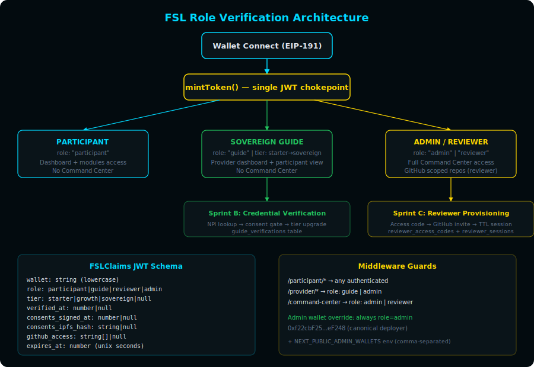

# Role Verification Architecture
## FSL Sovereign Data Governance — Three-Role Access Model
**Date:** May 9, 2026
**Status:** Sprint A deployed — foundation active
**Sprint B:** Guide credential verification + first-login consent
**Sprint C:** Reviewer flow + lab upload + GitHub auto-provisioning

---

## Overview

FSL implements three verification paths through a single JWT source of truth:

1. **Participant** — default role on wallet connect. Dashboard + module access.
2. **Sovereign Guide** — credentialed practitioners. Provider dashboard + participant view. Requires verification (Sprint B).
3. **Reviewer / Admin** — faculty reviewers and FSL admin. Full Command Center access.

All roles flow through `mintToken()` — a single chokepoint that signs HS256 JWTs with the FSLClaims schema. No JWT is ever minted outside this function.



---

## JWT Claim Schema (FSLClaims)

```typescript
interface FSLClaims {
  wallet: string;              // lowercase, canonical identifier
  role: "participant" | "guide" | "reviewer" | "admin";
  tier: "starter" | "growth" | "sovereign" | null;
  verified_at: number | null;  // unix timestamp of credential verification
  verification_id: string | null; // uuid from guide_verifications table
  consents_signed_at: number | null;
  consents_ipfs_hash: string | null;
  github_access: string[] | null;  // reviewer only — scoped repo list
  expires_at: number;          // unix seconds
}
```

### Backward Compatibility

Tokens minted under the old schema (pre-Sprint A) contain `address` instead of `wallet` and may lack `role`. The `getClaims()` function handles both:
- Falls back to `payload.address` if `payload.wallet` is absent
- Defaults to `role: "participant"` if no role claim exists
- Old tokens remain valid until their existing expiry

---

## Role Verification Matrix

| Capability | Participant | Guide (starter) | Guide (sovereign) | Reviewer | Admin |
|---|---|---|---|---|---|
| Dashboard + modules | ✓ | ✓ | ✓ | ✓ | ✓ |
| Provider dashboard | ✗ | ✓ | ✓ | ✗ | ✓ |
| Receive consent grants | ✗ | ✓ | ✓ | ✗ | ✓ |
| FSL Command Center | ✗ | ✗ | ✗ | ✓ | ✓ |
| Generate reviewer codes | ✗ | ✗ | ✗ | ✗ | ✓ |
| Contract minting (HNT) | ✗ | ✗ | ✗ | ✗ | ✓ |
| GitHub scoped repo access | ✗ | ✗ | ✗ | ✓ (TTL) | ✓ |

---

## Middleware Guards

```
/participant/*   → any authenticated JWT
/provider/*      → role: guide | admin
/command-center  → role: admin | reviewer
```

**Admin wallet override:** The canonical deployer wallet (`0xf22cbF25deEeA36FFF828BAf73CCb049345eF248`) is always treated as `role: admin` regardless of JWT claim. Additional admin wallets can be added via `NEXT_PUBLIC_ADMIN_WALLETS` environment variable (comma-separated, lowercase).

---

## Guide Verification Flow (Sprint B)

```
Connect wallet → role: participant
  ↓
Sign guide consent (EIP-191) → role: guide, tier: starter
  ↓
Submit credentials (NPI or certificate upload)
  → guide_verifications table: status = pending_review
  ↓
Admin review → approved/rejected
  ↓
Approved → JWT refreshed: verified_at set, tier upgradeable
```

### Database: guide_verifications

| Column | Type | Purpose |
|---|---|---|
| wallet_address | text UNIQUE | Canonical identifier |
| verification_type | licensed / credentialed | NPI path vs certificate path |
| license_number, npi | text | For NPI auto-verification |
| credential_type, institution | text | For certificate path |
| status | pending_review / approved / rejected | Review state |
| consents_signed_at | timestamptz | First-login consent gate |
| consents_ipfs_hash | text | Consent document anchored to IPFS |
| tier | text | starter → growth → sovereign |

---

## Reviewer Access Flow (Sprint C)

```
Admin generates access code
  → reviewer_access_codes table
  → Code emailed to reviewer (ASU faculty)
  ↓
Reviewer connects wallet + enters code
  → Validates: email domain, code not expired, code not used
  ↓
GitHub OAuth → invite to scoped repos (read-only)
  → reviewer_sessions table
  → JWT minted: role: reviewer, github_access: [repo list]
  ↓
Session TTL (e.g., 30 days)
  → Auto-revoke cron removes GitHub collaborator access
  → reviewer_sessions.revoked_at set
```

### Database: reviewer_access_codes

| Column | Type | Purpose |
|---|---|---|
| code | text PK | Unique invitation code |
| created_by_wallet | text | Admin who generated |
| expires_at | timestamptz | Code expiry |
| reviewer_email_domain | text | e.g., "asu.edu" |
| github_repos | text[] | Scoped repo list |
| used_at / used_by_* | timestamptz / text | Redemption tracking |

### Database: reviewer_sessions

| Column | Type | Purpose |
|---|---|---|
| wallet_address | text | Reviewer's connected wallet |
| github_username | text | Authenticated GitHub user |
| access_code | text FK | Which code was redeemed |
| expires_at | timestamptz | Session TTL |
| revoked_at | timestamptz | Auto-revoke or manual |

### Reviewer Access Scope

- **Full access:** FSL Command Center (evidence portfolio, contract explorer, deployment status)
- **No access:** Contract minting, HNT distribution, reviewer code generation
- **GitHub:** Read-only on scoped repos with TTL. Repos specified per access code.
- **Auto-revoke cron:** Sprint C deliverable. Runs daily, revokes expired sessions, removes GitHub collaborator access via GitHub API.

---

## HIPAA Position

FSL operates outside HIPAA regulatory scope by architectural design. The platform records only wallet-to-wallet session attestation on Sepolia testnet. No protected health information (PHI) transits FSL infrastructure:

- **No names** — wallet addresses are the sole identifier
- **No health records** — mood logs and nutrition entries are self-reported wellness data, not clinical records
- **No business associate relationship** — practitioners independently covered by HIPAA own their own compliance program. FSL is not their business associate.
- **Consent architecture** — participants grant and revoke access to their sovereign record via EIP-191 signatures. FSL enforces the access control layer but never reads the data.

The guide verification flow (Sprint B) collects practitioner credentials solely for directory credibility — not for establishing a covered entity relationship. NPI numbers are verified against the public NPPES registry, which is already public data.

---

## File Reference

| File | Purpose |
|---|---|
| `lib/auth/roles.ts` | FSLRole, GuideTier, FSLClaims type definitions |
| `lib/auth/isAdmin.ts` | Admin wallet check (canonical + env) |
| `lib/auth/getClaims.ts` | Server-side + client-side JWT decode |
| `lib/auth/mintToken.ts` | Single JWT minting chokepoint |
| `lib/auth/requireRole.ts` | Middleware factory for role guards |
| `middleware.ts` | Next.js middleware with route-level role enforcement |
| `db/migrations/001_role_verification_tables.sql` | Postgres schema |

---

## Sprint Sequence

| Sprint | Scope | Status |
|---|---|---|
| **A** | Auth primitives, JWT schema, middleware guards, DB tables | ✅ Deployed |
| **B** | Guide credential verification + first-login consent gate | Planned |
| **C** | Reviewer flow + GitHub provisioning + auto-revoke cron | Planned |
